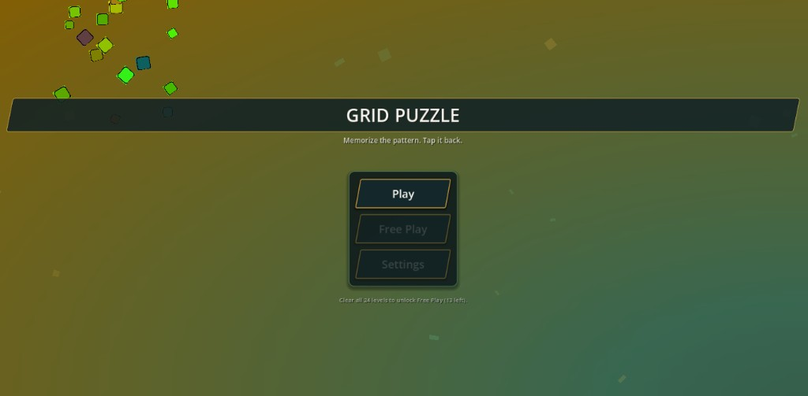
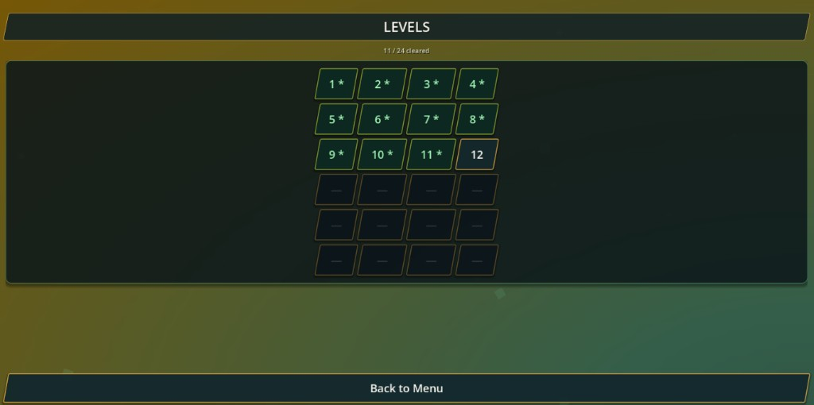
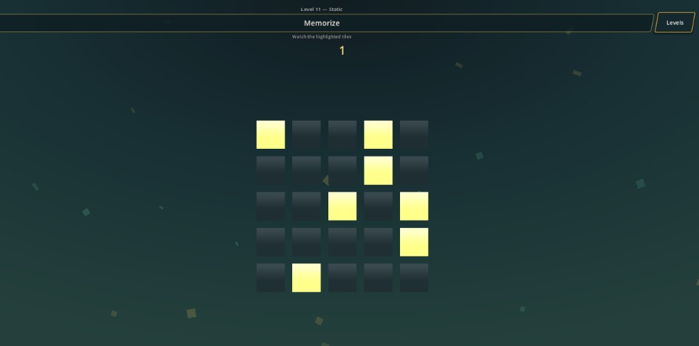
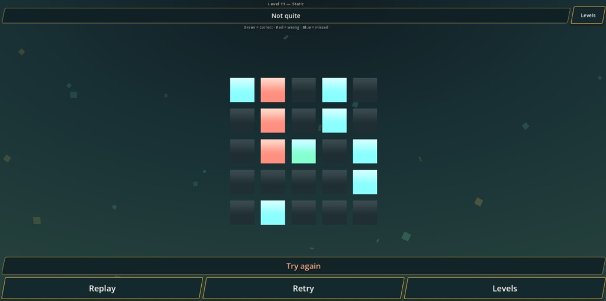

# Grid Puzzle

A mobile-first memory puzzle built with **Godot 4.6**. Memorize a scattered tile pattern, then tap it back before you forget.

Progress through a **24-level campaign** of fixed patterns that get harder as grids grow and memorize time shrinks. Clear every level to unlock **Free Play**, where you can customize the grid yourself.

---

## Screenshots

### Main menu



Start the campaign, or unlock Free Play / Settings after finishing all 24 levels.

### Level select



Linear unlock progression: cleared levels show in green, the current challenge is highlighted, and locked levels stay dimmed.

### Gameplay — memorize



Watch the highlighted tiles, then recreate the pattern when the countdown ends.

### Gameplay — results



After submit: **green** = correct, **red** = wrong, **blue** = missed. Retry, replay the same pattern, or jump back to the level list.

---

## How to play

1. Open **Play** from the main menu and pick an unlocked level.
2. **Memorize** — lit tiles flash briefly while the timer counts down.
3. **Recall** — tap tiles to match the pattern, then press **Submit**.
4. On a win, the next level unlocks. Use **Next**, **Retry**, **Replay**, or **Levels**.
5. Clear all **24** campaign levels to unlock **Free Play** and **Settings**.

### Controls

| Input | Action |
|--------|--------|
| Tap / click | Toggle a tile |
| Submit | Check your pattern |
| Android back | Leave the current screen |

---

## Features

- **24 campaign levels** with hand-authored, irregular patterns (no obvious shapes like crosses or frames)
- **Rising difficulty** — grids from 3×3 up to 7×7, more tiles, shorter memorize windows
- **Progress save** — unlocks and clears persist in `user://progress.cfg`
- **Free Play** — custom rows, columns, memorize time, highlight count, and tile gap (random patterns)
- **Clear visual feedback** — correct / wrong / missed tile states
- **Floating ambient artifacts** and soft UI styling (teal / amber palette)
- **AdMob** plugin wired for Android / iOS banners (test IDs in code)
- Portrait **720×1280** viewport with `canvas_items` stretch

---

## Campaign overview

| Stage | Levels | Grid | Feel |
|-------|--------|------|------|
| Early | 1–4 | 3×3 | Short patterns, longer memorize time |
| Intro | 5–9 | 4×4 | More tiles, tighter timing |
| Mid | 10–16 | 5×5 | Denser scatter patterns |
| Late | 17–22 | 6×6 | Fast recall, lots of noise |
| Finale | 23–24 | 7×7 | Master patterns |

Level data lives in [`resources/level_catalog.gd`](resources/level_catalog.gd).

---

## Requirements

- [Godot 4.6+](https://godotengine.org/) (project features: `4.6`, `Mobile`)
- Optional: Android SDK / export templates for APK builds
- Optional: AdMob plugin setup for real ads (samples use Google test unit IDs)

---

## Run locally

1. Clone or open this folder in Godot.
2. Import the project when prompted (`.uid` / import files may regenerate).
3. Press **F5** (or Play) — main scene is `res://assets/main_menu.tscn`.

Desktop runs in portrait stretch mode; touch is emulated from the mouse.

---

## Project structure

```text
GridPuzzleGame/
├── assets/               # Scenes (menu, settings, level select, audio, artifacts)
├── scripts/              # Game logic (main loop, UI, motion, SFX helpers)
├── resources/            # Level definitions, catalog, progress, preferences
├── Globals/              # Autoloads (GameSession, AdMob init)
├── styles/               # Shared StyleBox / theme pieces
├── shaders/              # Tile face shader
├── audio/                # UI / gameplay WAV SFX
├── textures/             # Backgrounds and art
├── docs/screenshots/     # README images
├── exports/              # Local build output (gitignored)
├── main.tscn             # In-level gameplay scene
└── project.godot
```

### Important autoloads

| Autoload | Role |
|----------|------|
| `GameSession` | Campaign vs Free Play mode, active level |
| `SceneSwitcher` | Fade transitions between scenes |
| `AudioManager` | UI and gameplay sounds |
| `GlobalStates` | AdMob initialization |

---

## Building / export

Export presets live in `export_presets.cfg` (gitignored — may contain signing paths). Typical targets:

- **Windows Desktop** → `exports/GridPuzzle.exe`
- **Android** (Gradle) → APK / AAB under `exports/`

Make sure Godot export templates for 4.6 match your editor version.

---

## Save data

| File | Contents |
|------|----------|
| `user://progress.cfg` | Highest unlocked level, cleared level list |
| `user://config.cfg` | Free Play grid settings |
| `user://user_prefs.tres` | Preference resource mirror |

---

## License / notes

Game project for learning and shipping a small mobile puzzle. AdMob and third-party addons under `addons/` keep their own licenses.

---

## Quick tip

If Free Play is locked, finish the remaining campaign levels from **Level Select** — the menu footer shows how many are left.
